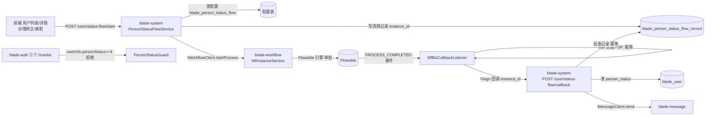

## 产品概述

继续推进《用户创建功能改造计划（对齐泛微 Ecology 架构）》的最后一期 **P3：状态流转工作流化 + 伴生初始化**。在已完成的 P0/P1/P2（用户核心字段、密码策略、字段配置驱动）基础上，把「人员状态变更」从直接改字段升级为**受审批流约束的状态机**，并补齐 Ecology 具备的新用户伴生初始化、组织联动通知、在职性登录拦截能力。

## 核心功能

1. **状态流转配置表**：新增 `blade_person_status_flow`，按 `from_status → to_status` 绑定 Flowable 流程（对齐 `hrm_state_proc_set`），转正/离职等变更走审批而非直接改字段。
2. **状态变更入口与审批闭环**：用户列表/详情提供「办理转正 / 办理离职」入口 → 经 `IWorkflowClient` 发起流程 → 审批通过后回调才落库 `person_status`（对齐 `HrmResourceTryAction/FireAction` 由工作流回调承担）。
3. **伴生初始化**：新用户创建时事务内初始化信息完善度记录（对齐 `HrmInfoStatus`：基本/个人/工作/系统四类）。
4. **消息通知**：创建成功后向直属主管（`managerId`）发送待办/欢迎消息，复用 blade-message 消息中心。
5. **在职性登录拦截**：登录成功后校验 `person_status`，**仅拒绝 4（解聘）**；在职集合 `in (0,1,2,3,5)`，退休(5) 仍可登录（对齐 Ecology `ResourceComInfo`）。

## 边界与约定

- 本轮**不做**第 10 章 Ecology 数据迁移（用户选择暂缓）。
- 本轮**不做** §12.3 / §13.5 的重启后联调回归（需用户重打包重启）。
- 需同步修订文档 §6 风险表中「离职/解聘/退休拒绝登录」的表述，与 P3-5 口径（只拒 4）保持一致。

## 技术栈选型

沿用项目既有技术栈，不引入新框架：

- 后端：Spring Boot 3.5.9 / Spring Cloud 2025.0.1 / Spring Cloud Alibaba 2025.0.0.0 / MyBatis-Plus 3.5.19 / MySQL 8 / Redis 7 / **Flowable（blade-workflow 已有）**
- 前端：Ant Design Pro（Umi Max + React + TypeScript + antd）
- 构建校验：`mvn -q -o -pl <模块> -am compile -DskipTests`、`npx tsc --noEmit`
- 建表执行：`doc/tools/RunSql.java`（JDK 21 单文件源码模式 + mysql-connector-j 9.7.0）

## 实现方案

### 总体策略

「配置表驱动 + 引擎事件回调」：blade-system 持有状态流转配置与流转记录表；发起流程走既有 `IWorkflowClient.startProcess`；审批完成由 **blade-workflow 新增的独立业务回调监听器** 通知 blade-system，由 blade-system 按 `instance_id` 查自己的流转记录后落库 `person_status`。

### 关键技术决策（含权衡）

**决策 1：审批完成回调机制 —— 新增独立监听器，不复用既有影子监听器**

- 现状（已勘察）：`WfEngineEventListener` → `WfStateProjector` 是「方案C 影子模式」，`@ConditionalOnProperty(blade.workflow.ledger-listener.enabled, matchIfMissing=false)` **默认关闭**，且类注释明确「不注入任何引擎 Service」（避免与 `processEngineConfiguration` 循环依赖），只投影 `wf_instance/wf_task` 台账，**不是通用业务回调钩子**。
- 选型：新增 `WfBizCallbackListener`（全局 `FlowableEventListener`），在 `FlowableConfig.java:129-133` 处与 ledger listener 并列注册进 `configuration.setEventListeners(...)`，独立开关 `blade.workflow.biz-callback.enabled`。
- 理由：① 复用项目已有的「无引擎依赖 + setEventListeners 直接装配」范式，规避循环依赖；② 对既有台账链路零侵入，可一键关闭回退；③ 比"轮询查询实例状态"实时且优雅（`IWorkflowClient` 契约已收敛，无实例状态查询接口）。
- 约束：监听器同样**不注入引擎 Service**，仅拿 `procInstId`，经 `WfInstanceMapper` 查 `wf_instance` 行做粗筛。

**决策 2：业务标识以「流转记录表 + instance_id」为准，不依赖 BPMN 变量**

- blade-system 发起流程时写入 `blade_person_status_flow_record(user_id, from_status, to_status, instance_id, status)`；
- 回调接口按 `instance_id` 反查该记录 → 落库 `person_status` → 天然幂等（记录已是终态则跳过）。
- 监听器侧用发起时写入的 `title` 前缀 `PSF:` 做一次粗筛，避免每条流程完成都跨服务调用。
- 理由：BPMN 变量需引擎 Service 才能读（监听器不注入），写入 `dataId`/`variables` 的约定又容易在流程设计变更后漂移；自建记录表可追溯、可审计、可补偿。

**决策 3：无流程配置时降级为直接改状态**
配置表查不到 `(from_status, to_status)` 映射时，直接改状态并在记录表标记 `mode=DIRECT`，保证功能不因流程未配置而不可用（对齐文档"配置表驱动"而非"强制工作流"的语义）。

**决策 4：在职判定单点收敛**
在 `blade-auth` 新增一个校验入口（如 `TokenUtil` 内或独立 `PersonStatusGuard`），`PasswordTokenGranter` / `CaptchaTokenGranter` / **`RefreshTokenGranter`** 三处统一调用。

- 必须包含 `RefreshTokenGranter`：否则已登录的离职账号可无限续期，拦截形同虚设。
- 判定：`person_status == 4`（解聘）拒绝，其余放行；`person_status` 为 NULL（存量数据）按在职放行，保证向后兼容。
- 提示语统一为「账号已停用」。

**决策 5：伴生初始化与消息通知的事务边界**

- 伴生初始化（写 `blade_user_complete_status`）在 `doSubmit` **事务内**，与主表强一致（P2 的扩展表写入已是此范式）。
- 消息通知在**事务外**（提交成功后）发送，异常仅记日志不回滚主流程——避免消息中心抖动导致建档失败。

### 性能与可靠性

- 登录拦截：零额外 I/O（`userInfo` 已带 `person_status`），纯内存判定。
- 回调链路：仅 `PROCESS_COMPLETED` 触发一次 `wf_instance` 查询 + 一次 Feign；`title` 前缀粗筛过滤掉绝大多数无关流程。
- 幂等：流转记录表按 `instance_id` 唯一，`ON DUPLICATE KEY UPDATE` 语义；重复回调安全。
- 兜底：`IWorkflowClient` 有 `IWorkflowClientFallback`，发起失败时返回明确错误，不改状态。

## 实施要点（防回归）

- **不改既有 `WfStateProjector` / `WfEngineEventListener` 任何逻辑**，仅在 `FlowableConfig` 注册处追加监听器，且用独立开关保护。
- `UserServiceImpl` 构造函数已注入 10 个依赖，新增 `IPersonStatusFlowService` / `IUserCompleteStatusService` / `IMessageClient` 时同步扩展构造参数（保持构造注入风格，不用字段 `@Autowired`）。
- 实体统一继承 `TenantEntity`，`@TableId(type=IdType.ASSIGN_ID)` + `@JsonSerialize(using=ToStringSerializer.class)`；Controller 加 `@PreAuth(RoleConstant.HAS_ROLE_ADMIN)` + `@Operation`。
- 唯一键 × 逻辑删除冲突沿用 §6 既定对策：不做「唯一键加 is_deleted」；流转记录表用 upsert。
- 环境：Nacos 未启动（8848 无监听）→ 网关 :81 无路由，验证必须**直连** blade-auth `localhost:8100`（token 端点 `POST /token`）、blade-system `localhost:8106`；运行 jar 来自 `E:\project\...`，工作副本为 `D:\project\springbladeandreact`，新改动需重打包重启才生效。

## 架构设计



## 目录结构

```
SpringBlade/
├── doc/
│   ├── sql/
│   │   └── alter_blade_user_person_status_flow.sql   # [NEW] P3 建表：blade_person_status_flow（from/to_status + flow_key + callback_bean）、blade_person_status_flow_record（user_id/from/to/instance_id/status/mode）、blade_user_complete_status（user_id/item/done）；含 UK(instance_id)、UK(user_id,item)
│   ├── tools/
│   │   └── verify-p3.cjs                              # [NEW] P3 联调脚本：直连 8100/8106，验证登录拦截/发起流转/回调改状态/完善度/消息
│   └── md/
│       └── 用户创建功能改造计划-对齐ecology架构.md      # [MODIFY] 修订 §6 风险表在职判定口径；头部版本 v1.4 与实施状态；新增「§14 P3 实施记录」
├── blade-service-api/
│   └── blade-user-api/src/main/java/org/springblade/system/user/feign/
│       └── IUserStatusFlowClient.java                 # [NEW] 供 blade-workflow 回调的 Feign 契约：POST /user/status-flow/callback
├── blade-auth/src/main/java/org/springblade/auth/
│   ├── utils/TokenUtil.java                           # [MODIFY] 新增在职性校验（或新建 PersonStatusGuard 收敛判定与提示语）
│   └── granter/
│       ├── PasswordTokenGranter.java                  # [MODIFY] userInfo 获取后调用在职性校验
│       ├── CaptchaTokenGranter.java                   # [MODIFY] 同上
│       └── RefreshTokenGranter.java                   # [MODIFY] 同上传入 userId 版本，防止离职账号无限续期
├── blade-service/blade-system/src/main/java/org/springblade/system/
│   ├── enums/PersonStatusEnum.java                    # [NEW] 状态枚举 + IN_SERVICE 判定（只拒 4），单点收敛口径
│   ├── entity/PersonStatusFlow.java                   # [NEW] 状态流转配置实体
│   ├── entity/PersonStatusFlowRecord.java             # [NEW] 流转记录实体（含 instance_id、mode）
│   ├── entity/UserCompleteStatus.java                 # [NEW] 信息完善度实体（对齐 HrmInfoStatus）
│   ├── mapper/{PersonStatusFlow,PersonStatusFlowRecord,UserCompleteStatus}Mapper.java  # [NEW] 三个 Mapper
│   ├── dto/StatusFlowCallbackDTO.java                 # [NEW] 回调入参（instanceId + 结果）
│   ├── service/IPersonStatusFlowService.java + impl/  # [NEW] 查配置、发起流程、回调落库、流转列表
│   ├── service/IUserCompleteStatusService.java + impl/# [NEW] 初始化/查询完善度
│   ├── service/impl/UserServiceImpl.java              # [MODIFY] doSubmit 内写完善度；创建成功后事务外发消息；构造注入扩展
│   ├── controller/UserController.java                 # [MODIFY] 新增 /user/status-flow/{start,list}、/user/complete-status
│   └── controller/UserStatusFlowController.java       # [NEW] 状态流转发起与回调端点（回调需放开鉴权或走服务间白名单）
└── blade-service/blade-workflow/src/main/java/org/springblade/workflow/
    ├── listener/WfBizCallbackListener.java            # [NEW] 独立业务回调监听器（PROCESS_COMPLETED，不注入引擎 Service，title 前缀粗筛）
    └── config/FlowableConfig.java                     # [MODIFY] setEventListeners 处并列注册新监听器，独立开关 blade.workflow.biz-callback.enabled

ant-design-pro/src/
├── services/system/user.ts                            # [MODIFY] 新增 startStatusFlow / statusFlowList / completeStatus API 与类型
├── pages/System/User/
│   ├── UserStatusFlowModal.tsx                        # [NEW] 办理状态变更弹窗：选择目标状态 → 发起流程/直改 → 展示流转进度
│   ├── User.tsx                                       # [MODIFY] 列表增「办理状态变更」按钮 + 在职状态标签（解聘置灰）
│   └── UserView.tsx                                   # [MODIFY] 详情展示信息完善度
```

## 关键代码结构

```java
/** 人员状态枚举：在职判定单点收敛（只拒 4 解聘，对齐 Ecology ResourceComInfo） */
public enum PersonStatusEnum {
    PROBATION(0, "试用"), REGULAR(1, "正式"), TEMPORARY(2, "临时"),
    EXTENDED(3, "延期"), DISMISS(4, "解聘"), RETIRE(5, "退休");

    private final int code;
    private final String desc;

    /** 是否允许登录：仅解聘(4) 拒绝；null（存量数据）按在职放行 */
    public static boolean loginAllowed(Integer personStatus) {
        return personStatus == null || personStatus != DISMISS.code;
    }
}
```

```java
/** 状态流转服务：配置驱动 + 审批回调 */
public interface IPersonStatusFlowService extends BaseService<PersonStatusFlow> {
    /** 发起状态变更：命中配置则发起 Flowable 流程（返回 instanceId），未命中则直改 */
    R<String> start(Long userId, Integer toStatus, String opinion);
    /** 审批完成回调：按 instanceId 反查记录，幂等更新 person_status */
    R<Boolean> callback(StatusFlowCallbackDTO dto);
    /** 某用户可用流转配置（供前端渲染按钮） */
    List<PersonStatusFlow> availableFlows(Long userId);
}
```

## 设计风格

沿用项目现有 Ant Design Pro 企业后台风格（非另起视觉体系）：卡片式布局、克制的留白与分割线、信息密度优先。本次为**在既有用户管理页内扩展交互**，不新建独立页面，保持与 UserAdd/UserEdit/UserView 完全一致的栅格（Col span=12）、标题层级（h3 16px/600）与按钮位置（右下角 Space）约定。

## 页面与区块设计

1. **用户列表页（User.tsx）**

- 顶部工具栏新增「办理状态变更」主按钮（仅选中单行时可用）；行内「更多」下拉也提供入口。
- 状态列改用 Tag 呈现：在职态（0/1/2/3/5）绿色、解聘(4) 灰色 + 删除线语义，鼠标悬停显示状态含义。

2. **办理状态变更弹窗（UserStatusFlowModal.tsx，新增）**

- 区块一「当前状态」：只读展示当前人员状态 Tag 与目标人员姓名/工号，避免误操作。
- 区块二「变更为」：单选卡片组渲染可用目标状态（来自配置表），卡片含状态名 + 是否需要审批的角标。
- 区块三「办理说明」：TextArea 审批意见，必填校验。
- 区块四「流转进度」：Timeline 展示该用户历史流转记录（发起时间、发起人、审批结果、完成时间），审批中显示加载态 Tag。
- 底部右下角「取消 / 提交办理」按钮组；提交后 Toast 提示「已发起审批」并关闭弹窗、刷新列表。

3. **详情页（UserView.tsx）**

- 在 Descriptions 末尾追加「信息完善度」区块：四类（基本/个人/工作/系统）以 Progress 或 Tag 呈现完成度。

## 交互与动效

- 弹窗入场用 antd 默认缩放淡入，不引入额外动效库；提交按钮 loading 态防重复点击。
- 审批中状态使用 Tag 的脉冲呼吸微动效（CSS animation，低强度），明确「等待外部审批」的系统状态。
- 所有操作失败统一 `message.error` 展示后端返回的 msg（如「账号已停用」），不做二次包装。

## 响应式

沿用 ProTable 与 Modal 的既有响应式能力；弹窗宽度在窄屏下由 720px 降为全屏，表单栅格由两列降为单列。

## Agent Extensions

### Skill

- **flowable-workflow-builder**
- Purpose：生成「人员转正」「人员离职」两套 Flowable BPMN 2.0 流程定义（节点/连线/审批人/候选组/操作菜单/字段权限齐全），供 blade-workflow 部署后与 `blade_person_status_flow.flow_key` 绑定
- Expected outcome：产出可直接导入 `/system/workflow` 的 `.bpmn20.xml`，部署后取得可用 procKey，满足用户选择的「深度接入审批流」前置条件
- **springblade-dev-login**
- Purpose：在 Nacos 未启动、网关无路由的情况下，用真实前端请求头直连 blade-auth/blade-system 完成 P3 联调（登录拦截、发起流转、回调改状态、完善度、消息）
- Expected outcome：拿到有效 sword-token 并跑通 `doc/tools/verify-p3.cjs` 的全部断言

### SubAgent

- **code-explorer**
- Purpose：深挖三处未知面，降低方案风险：① blade-workflow 现有可用流程定义（`wf_process_definition` 表结构与现有 procKey）与部署入口；② blade-message 是否已有「按用户取/建单聊会话」能力（`MessageSendDTO.sessionId` 必填，若无可用的会话接口需补一个）；③ `UserInfo` 链路是否确实带出 `personStatus`，以及 `RefreshTokenGranter` 拦截的连带影响
- Expected outcome：输出确定的落点文件与是否需要新增 Feign 方法的结论，避免实现阶段返工