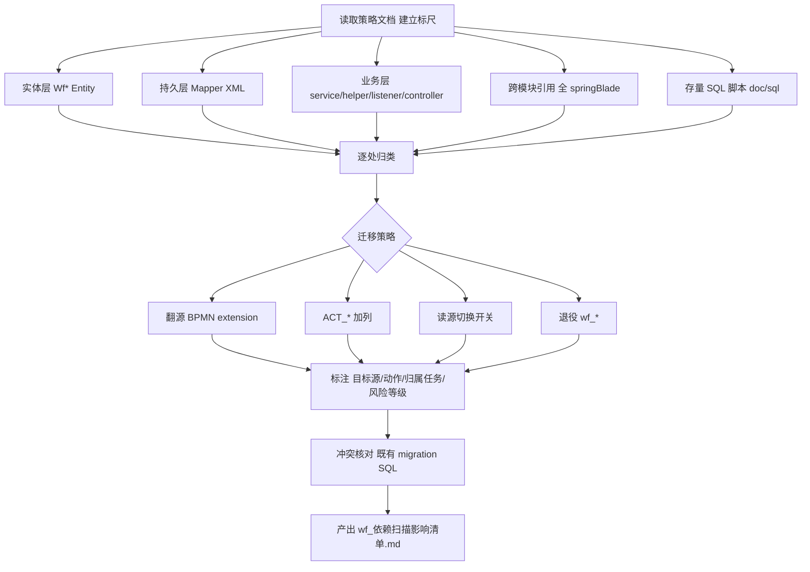

## 用户需求

执行《Flowable8承接台账模块-去wf_表改造分析.md》中的 T-1 任务：对承接台账模块做代码级 `wf_*` 引用面全量精确盘点，输出可落地的改造影响清单。当前状态为 ⬜ 未启动，是 T-2/T-5/T-10/T-11 等后端任务的地基。

## 产品概述

在不修改任何代码、不执行 DDL 的前提下，对 `blade-workflow` 服务（及其 API 包与必要的跨模块引用）做一次结构化的 `wf_*` 依赖普查，形成一份按"表/字段 → 引用点(文件:行) → 目标源(ACT_*/BPMN) → 改造动作 → 归属任务 → 风险等级"组织的改造影响清单。

## 核心功能

- 全量扫描 `wf_*` 实体、MyBatis XML Mapper、业务层读写、跨模块引用、存量 SQL 脚本
- 按既有迁移策略逐处分类：翻源 BPMN extension / ACT_* 加列 / 读源切换开关 / 退役
- 标注风险等级（P0 阻断 / P1 / P2）并映射到后续归属任务（T-2/T-5/T-10/T-11 等）
- 与 `doc/sql/migration/` 下既有 `V*__*.sql` 做冲突核对，给出结论

## 技术选型

- 任务性质：静态代码审计 + 文档产出，无任何运行时改动、无建表/DDL。
- 检索手段：文本扫描（search_content）+ [subagent:code-explorer] 跨目录综合扫描 + [skill:lsp-code-analysis] 语义级引用分析（find references / impact analysis）。
- 产出物：Markdown 影响清单文档。

## 实施方法

### 高层策略

先读取既有策略文档建立"分类标尺"，再分五层（实体 / 持久层 Mapper / 业务层 service+helper+listener+controller / 跨模块引用 / 存量 SQL 脚本）扫描，逐处归类并标注目标源、动作、归属任务与风险等级，最后与既有 migration SQL 做冲突核对并落盘文档。

### 关键技术决策

- **以既有决策文档为唯一分类依据**：优先复用《去wf_表-D系列决策结论》《wf_退役影响清单》《去wf_表-读源切换开关说明》《去wf_表-定义主记录翻源设计》《wf_BPMN扩展schema定稿》，不重造轮子，确保分类与已定方案一致。
- **文本扫描 + LSP 语义分析互补**：文本扫描覆盖广但会漏掉接口多态、MyBatis 动态 SQL（`<if>`/`<foreach>`）、符号别名等；用 [skill:lsp-code-analysis] 的 find references 精确补全盲区，获得每个 `wf_*` 符号的真实调用点（文件:行）。
- **大范围综合扫描交给 subagent**：109+ 命中需跨多目录、多命名约定收敛到台账模块，[subagent:code-explorer] 以 `very thorough` 模式一次性地毯式收集，避免反复零散查询。

### 性能与可靠性

- 扫描范围限定在 `springBlade` 后端（`*.java`/`*.xml`/`*.sql`），排除 `frontend`、`flowable-engine`、`ant-design-pro` 等无关子树，降低噪声。
- 对命中结果去重、收敛到台账相关（blade-workflow 及其 API），避免把流程设计器通用能力误判为台账改造点。

## 实施注意

- **严格只读**：plan 阶段不修改任何文件、不执行 migration/DDL；仅产出分析文档。
- 复用既有 search 习惯与策略文档结论，避免臆造目标源。
- 风险等级标注需与 §17.6 任务快照对齐（P0 = 阻断 T-2/T-5 的前置）。

## 架构设计（分类模型）



## 目录结构

```
springBlade/
└── doc/md/
    ├── Flowable8承接台账模块-去wf_表改造分析.md   # [EXIST] 主分析文档，T-1 任务来源与状态快照(§17.6)
    ├── wf_退役影响清单.md                        # [EXIST] 哪些 wf_* 表/字段最终退役（分类标尺之一）
    ├── 去wf_表-D系列决策结论.md                   # [EXIST] 翻源 vs 加列 vs 退役 决策（分类标尺之一）
    └── wf_依赖扫描影响清单.md                     # [NEW] T-1 交付物：结构化改造影响清单（表/字段→引用点→目标源→动作→归属任务→风险等级），附既有 migration SQL 冲突核对结论
```

## 推荐使用的 Agent 扩展

### SubAgent

- **code-explorer**
- 用途：对 `d:/workproject/springbladeandreact/springBlade` 后端做 `very thorough` 级综合扫描，覆盖实体/Mapper XML/业务层/跨模块/SQL 脚本中全部 `wf_*` 引用点。
- 预期结果：产出全量 `wf_*` 引用清单（去重、收敛到台账模块范围），作为分类与文档起草的原始素材。

### Skill

- **lsp-code-analysis**
- 用途：对 `Wf*` 实体类与 `wf_*` 表相关符号做语义级 find references / impact analysis，补全文本扫描在接口多态、MyBatis 动态 SQL、符号别名处的盲区。
- 预期结果：精确列出每个 `wf_*` 符号在所有真实调用点的 `文件:行`，提升影响清单的可信度与完整性。