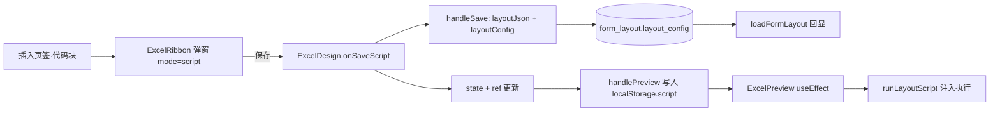

## 用户需求

设计器「插入代码块」目前是空壳：Excel 中只写入文本「💻 代码块」，预览中只是把代码当纯文本显示（`<pre>`），并未真正生效。需参照泛微 ecology 的实现，把「代码块」做成**可执行脚本**。

## 产品概述

对齐 ecology：代码块 = 整份表单**一份**自定义 HTML/JS 脚本，保存后于预览/表单加载时注入 DOM 执行，用于扩展表单行为、嵌入第三方内容。

## 核心功能

- **布局级代码块**：整份表单一个脚本，**不占单元格**、不在 Excel 网格中插入内容。
- **代码编辑弹窗**：「插入」页签点击「代码块」打开弹窗（单一代码文本域，初始提示 `<script>`）；弹窗按钮文案为**「保存」**（其余元素仍为「插入」）；再次点击「代码块」**回显已保存内容**供修改。
- **持久化**：脚本随布局保存到后端 `layout_config`，刷新后回显。
- **预览执行**：预览（弹窗与独立预览页）加载后，脚本注入 DOM 真实执行（含 `<script>` 执行、HTML 输出渲染），异常不影响表单渲染。
- **清理**：移除原「代码块」的单元格级占位语义（Excel 侧的 `💻 代码块` 插入、预览侧纯文本 `<pre>` 展示）。

## 技术栈

- 前端：React + TypeScript + antd（现有 `ExcelDesign` 模块）；预览沿用现有 `ExcelPreview`
- 网格：Univer（本次**不改动** Univer 源码/lib）
- 后端：SpringBlade（**无需改动**，复用既有 `layout_config` 字段）

## 实现思路

核心策略：**布局级脚本存 `layoutConfig`，预览端 DOM 注入执行**。

关键决策与依据：

1. **存储位置选择 `layout_config`（零后端改动）**
已核实 `FormLayout` 实体、`FormLayoutSaveDTO`、`FormLayoutController` 端到端已支持 `layout_config` 字段，且前端全项目 **0 处引用**（完全空闲）。因此脚本以 `JSON.stringify({ script })` 存入即可，**无需改后端、无需 DDL**。
风险提示：`POST /save` 是全量覆盖式保存，故**必须与 `layoutJson` 一同提交**，单独提交 `layoutConfig` 会把 `layoutJson` 覆盖为空 → 统一在现有 `handleSave` 载荷里追加该字段。

2. **执行方式：动态创建 `<script>` 元素**
`innerHTML` 注入的 `<script>` **不会执行**（浏览器安全策略）。必须：先用模板节点解析出 HTML 与 `<script>` 节点，HTML 部分 `append` 到容器，`script` 部分用 `document.createElement('script')` 复制属性与 `text` 后 append 才会真实执行。ecology 依赖 `jQuery.append` 的同一特性。

3. **注入时机：容器随 JSX 渲染，执行放 `useEffect`**
脚本常要操作表单 DOM，`useEffect` 在 DOM commit 后运行，可保证表单已存在；用 ref 记录已执行内容，避免重渲染重复执行；卸载时清空容器。

4. **兼容处理取最小必要子集**（参照 `manageScriptContent`，不做过度设计）
仅剔除 `<html>/<body>/<head>` 包裹标签；不全局覆写 `document.write`（YAGNI，风险高）；整体 `try/catch`，单脚本失败不阻断表单渲染。

5. **弹窗语义隔离**
新增 `mode: 'script'`，仅 `code` 使用：不写单元格、按钮显示「保存」、提交走 `onSaveScript`；其余元素类型（图片/链接/Iframe 等）保持原「插入」语义与 `insertElement` 路径不变，改动面可控。

## 数据流



## 执行要点（防回归）

- **保存竞态**：沿用现有 `handleSave` 链路（`saveLayoutData()` → `saveFormLayout` → `loadFormLayout(true)`），脚本值用 `ref` 读取最新值，避免 state 异步导致保存旧值。
- **预览数据通道**：`handlePreview` 写入 localStorage 的对象追加顶层 `script` 字段；`ExcelPreview` 读 `layoutData.script`。`UniverExcelGrid.loadLayoutData` 只解析 `sheets/cellData`，多余顶层字段安全。
- **向后兼容**：历史布局中残留的 `elementType:'code'` 单元格，移除 `case 'code'` 后走默认渲染，不会白屏。
- **性能**：脚本仅在「内容变化 / 预览打开」时执行一次；容器卸载清空，避免重复绑定与内存泄漏。
- **日志**：执行失败 `console.warn` 提示脚本序号与错误，不 dump 整段代码。

## 目录结构

```
ant-design-pro/src/pages/FormMode/ExcelDesign/
├── utils/
│   └── runLayoutScript.ts          # [NEW] 布局脚本执行器。导出 runLayoutScript(container, code)：
│                                   #   预处理（剔除 html/body/head 包裹）→ 解析分离 HTML 与 script 节点
│                                   #   → HTML append 到容器 → script 节点逐个 createElement 复制
│                                   #   属性/text 后 append 以真实执行；try/catch 包裹，返回执行结果摘要。
│                                   #   另导出 clearScriptContainer(container) 用于卸载/重跑前清理。
├── ExcelDesign.tsx                 # [MODIFY] 新增 layoutScript state + layoutScriptRef；
│                                   #   loadFormLayout 解析 result.data.layoutConfig 取出 script 回显；
│                                   #   handleSave 载荷追加 layoutConfig: JSON.stringify({ script })；
│                                   #   handlePreview 写入 localStorage 的布局对象追加顶层 script；
│                                   #   向 <ExcelRibbon> 传 layoutScript 与 onSaveScript。
├── components/
│   ├── ExcelRibbon.tsx             # [MODIFY] InsertDef 新增 mode:'script'；INSERT_DEFS.code 改为
│                                   #   script 模式（移除 language，保留单个 content 文本域，
│                                   #   placeholder 提示 <script>）；openInsert 用 layoutScript 预填；
│                                   #   submitInsert 对 script 调用 onSaveScript(content) 而非
│                                   #   insertElement；Modal 的 title/okText 按 mode 区分
│                                   #   （script → 「代码块」/「保存」）；新增 props layoutScript、onSaveScript。
│   ├── ExcelPreview.tsx            # [MODIFY] 删除 renderElementNode 中 case 'code' 的 <pre> 纯文本分支；
│                                   #   在预览内容末尾渲染脚本容器 div（ref）；useEffect 中读取
│                                   #   layoutData.script 调 runLayoutScript 注入执行，卸载时清理。
│   ├── UniverExcelGrid.tsx         # [MODIFY] 移除 ELEMENT_META 中的 code 条目，清理单元格级代码块残留语义。
│   └── ExcelPreviewPage.tsx        # [无需改动] 已透传整份 layoutData，script 字段自动可达。
└── ribbonRegistry.ts               # [MODIFY] openInsert 兜底分支对 code 不再调用 insertElement
                                    #   （仅在 window 桥接缺失时生效，避免误插单元格）。
```

## 关键结构

```ts
// utils/runLayoutScript.ts
export interface RunScriptResult {
  /** 成功执行的 script 块数量 */
  executed: number;
  /** 执行失败的块索引与错误信息（不回显整段代码） */
  errors: Array<{ index: number; message: string }>;
}

/** 在容器内注入并执行布局级脚本：HTML 直接渲染，<script> 动态创建后执行 */
export function runLayoutScript(container: HTMLElement, code: string): RunScriptResult;

/** 清空已注入内容与节点（重跑/卸载前调用） */
export function clearScriptContainer(container: HTMLElement): void;
```

## Agent Extensions

### MCP

- **Playwright MCP Server**
- 用途：端到端验证代码块功能（打开设计器 → 插入代码块填写脚本 → 保存 → 刷新回显 → 预览确认脚本真实执行生效）
- 预期结果：确认脚本持久化、回显与预览执行均生效，且异常脚本不导致预览白屏