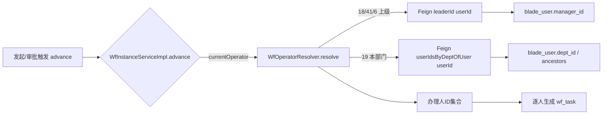

## 用户需求

补齐流程节点「操作者」解析中 E9 对齐的两个缺口，使「上级类」与「本部门」由当前降级为空集合改为真正解析为办理人，与 ecology（E9）语义对齐。

## 核心功能

- **上级类操作者真正可解析**：18 创建人上级、41 上级、6 字段-人员上级，解析为对应用户的「个人主管（直线经理）」。
- **本部门（19）真正可解析**：解析为「到达本节点的当前办理人所在部门」的成员。
- 数据源决策（已与用户确认）：上级 = 给 `blade_user` 新增 `manager_id` 字段（个人主管，最贴近 E9 的 ManagerID）；本部门 = 当前办理人（首节点为发起人、后续节点为上一节点完成人）的部门成员。
- 前端 `NodeOperatorModal` 的操作者类型下拉已含 18/41/6/19 等类型码，本次仅补齐后端解析，无需改动前端。

## 验收效果

- 节点配置「上级/本部门」后发起或审批流程，引擎侧能在 `wf_task` 生成对应主管 / 部门成员的多条待办（或签/会签/依次门禁由既有逻辑控制），不再回退为引擎单值 assignee。
- 用户中心（blade-system）不可用时保持既有降级策略：解析为空 → 回退引擎 assignee，不阻塞流转主链路。

## 技术栈

- 后端：SpringBlade（Java 21 + Spring Boot + MyBatis-Plus + OpenFeign + Flowable），多模块微服务。
- 跨服务调用：blade-workflow → blade-system 用户中心，必须走 OpenFeign（接口在 `blade-user-api`，实现在 `blade-system`）。
- 前端：无需改动（操作者类型码已存在）。

## 实现方案

整体策略：在用户中心补齐两个查询能力（取主管、取某人所在部门成员），并在流程操作者解析器补四个分支；为支持「本部门」需把「到达本节点的当前办理人」传入 `advance` 与 `resolve`。

### 数据流



### 一、数据源（blade_user.manager_id）

- DB 迁移脚本 `doc/sql/migration/009_wf_operator_leader.sql`：
`ALTER TABLE blade_user ADD COLUMN manager_id BIGINT(20) DEFAULT NULL COMMENT '主管用户ID（上级/直线经理）';`
（幂等：先 `SELECT 1 FROM information_schema.columns` 判断，存在则跳过）。
- 运行态验证前需手动给若干用户填 `manager_id`（如 `UPDATE blade_user SET manager_id=xxx WHERE id=yyy;`），否则上级解析为空。

### 二、API 模块（blade-user-api，改动触发双仓库同步）

- `entity/User.java`：新增 `private Long managerId;`（下划线转驼峰可自动映射，建议显式加 `@TableField("manager_id")` 与 `@Schema`）。
- `feign/IUserClient.java` 新增两个方法（沿用既有 `@GetMapping` + `@RequestParam` 风格，规避「@RequestBody 根泛型容器」坑）：
- `R<Long> leaderId(@RequestParam("userId") Long userId)`：返回该用户 `manager_id`（无则 null）。
- `R<List<Long>> userIdsByDeptOfUser(@RequestParam("userId") Long userId, @RequestParam(value="containChild", required=false) Boolean containChild)`：返回该用户所在部门的成员ID。
- `feign/IUserClientFallback.java`：补两个 `R.fail(...)` 降级实现（与现有四个同构）。

### 三、服务端（blade-system）

- `mapper/UserMapper.java` 新增：
- `Long selectManagerId(@Param("userId") Long userId);`
- `List<Long> selectUserIdsByDeptOfUser(@Param("userId") Long userId, @Param("containChild") Boolean containChild);`
- `mapper/UserMapper.xml` 新增两条 SQL（沿用 FIND_IN_SET 多值匹配、不写 tenant_id 由拦截器注入）：
- `selectManagerId`：`SELECT manager_id FROM blade_user WHERE id=#{userId} AND is_deleted=0`
- `selectUserIdsByDeptOfUser`：先用子查询取 userId 的 `dept_id`（记为 d），再 `WHERE is_deleted=0 AND (FIND_IN_SET(#{d}, dept_id) > 0 [<if containChild> OR FIND_IN_SET(#{d}, ancestors) > 0</if>])`。
- `feign/UserClient.java`：新增两个 `@GetMapping` 端点，复用已注入的 `UserMapper`。

### 四、消费方（blade-workflow）

- `resolver/WfOperatorResolver.java`：
- `resolve` 签名增加 `Long currentOperator`（保留 `starter`）；`resolveByType` 增加分支：
    - `OP_CREATOR_LEADER(18)` → `leaderId(starter)`
    - `OP_LEADER(41)` → `leaderId(starter)`（按用户决策「实现上取 starter」）
    - `OP_FIELD_USER_LEADER(6)` → `leaderId(parseId(formData.get(op.getObjId())))`
    - `OP_DEPT_SELF(19)` → `userIdsByDeptOfUser(currentOperator, containChild)`
- 新增 `leaderId(userId)`、`userIdsByDeptOfUser(userId, containChild)` 两个私有方法，复用既有 `remote(...)` 包装（失败/空 → warn + 空集合，绝不抛异常）。
- 更新类注释支持矩阵：18/41/6/19 改为「已支持」，删除「上级未实现 / 本部门不支持」旧段落；常量 `OP_CREATOR_LEADER/OP_LEADER/OP_FIELD_USER_LEADER/OP_DEPT_SELF` 已存在，直接复用。
- `service/impl/WfInstanceServiceImpl.java`：
- 新增重载 `advance(Long instId, Long currentOperator)`；保留旧 `advance(Long instId)` 委托为 `advance(instId, inst.getStarter())`（首节点到达人 = 发起人）。
- 循环内改为 `operatorResolver.resolve(defId, tk, instId, starter, currentOperator)`。
- `start()` 调 `advance(inst.getId(), starter)`。
- `service/impl/WfTaskServiceImpl.java`：`doApprove` 在 `processService.completeTask` 之后把 `advance(inst.getId())` 改为 `advance(inst.getId(), operator)`（operator = 刚完成节点的办理人，作为到达下一节点的当前办理人；自动通过时 operator=AUTO_OPERATOR=0，本部门/上级将解析为空并回退，符合预期）。
- `IWfInstanceService` 接口同步新增 `advance(Long instId, Long currentOperator)`（保留旧方法，向后兼容）。

### 五、双 Maven 仓库同步（关键，必做）

- `mvn -pl blade-service-api/blade-user-api clean install -DskipTests "-Dmaven.compiler.proc=full"` → 进 `~/.m2`
- 复制 `blade-user-api-5.0.1.jar` → `E:\project\mavenLib\org\springblade\blade-user-api\5.0.1\`（先 Rename 让位再 Copy，否则被 IDEA 占用静默跳过）
- `mvn -pl blade-service/blade-system compile "-Dmaven.compiler.proc=full"` → BUILD SUCCESS
- `mvn -pl blade-service/blade-workflow compile "-Dmaven.compiler.proc=full"` → BUILD SUCCESS
- 严禁 `mvn -Dmaven.repo.local=E:/...`（PowerShell 冒号误判）；消费者编译不带 `-am`；成败看 `BUILD SUCCESS|FAILURE` 文本。

## 实现要点

- 降级策略不变：任何远端查询失败一律 warn + 空集合，advance 在解析为空时回退引擎 assignee，不阻塞流转。
- 幂等：advance 生成待办仍用 `(engineTaskId, assignee)` 判重，避免同节点第二人被去重。
- 语义简化说明（已在用户决策范围内）：41 与 18 实现上均取发起人主管；本部门取「到达节点当前办理人」部门，符合用户选定的「当前办理人」口径。严格按「上一节点操作者」的精细语义已由该简化覆盖。

## 目录结构与改动文件

```
springBlade/
├── blade-service-api/blade-user-api/
│   └── src/main/java/org/springblade/system/user/
│       ├── entity/User.java                     [MODIFY] 新增 managerId 字段
│       └── feign/
│           ├── IUserClient.java                 [MODIFY] 新增 leaderId / userIdsByDeptOfUser
│           └── IUserClientFallback.java         [MODIFY] 补两个降级实现
├── blade-service/blade-system/
│   └── src/main/java/org/springblade/system/
│       ├── mapper/
│       │   ├── UserMapper.java                  [MODIFY] 新增两个查询方法
│       │   └── UserMapper.xml                   [MODIFY] 新增两条 SQL
│       └── feign/UserClient.java                [MODIFY] 新增两个端点
├── blade-service/blade-workflow/
│   └── src/main/java/org/springblade/workflow/
│       ├── resolver/WfOperatorResolver.java     [MODIFY] 补 18/41/6/19 分支 + currentOperator 参数
│       └── service/impl/
│           ├── WfInstanceServiceImpl.java       [MODIFY] advance 增加 currentOperator 重载
│           └── WfTaskServiceImpl.java           [MODIFY] doApprove 传 operator 到 advance
│       └── service/IWfInstanceService.java      [MODIFY] 接口新增 advance(instId, currentOperator)
└── doc/sql/migration/
    └── 009_wf_operator_leader.sql              [NEW] ALTER blade_user ADD manager_id（幂等）
```