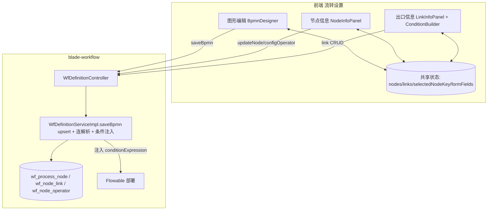

## 产品概述

在流程设计页（`/formmode/workflowdesign?defId=xxx`）的「流转设置」页签内，按 E9 `pathDetail/flowSet/pictureEdit` 的交互，拆分为**图形编辑、节点信息、出口信息**三个子页签，三页签联动、数据实时同步，形成「画图 -> 配节点 -> 配出口条件」的流程设计闭环。

## 核心功能

- **图形编辑**：保留现有 bpmn-js 画布，支持节点拖拽、连线、缩放、平移、导入/导出 XML、保存画布、部署；选中节点时对外抛出选中项，并支持外部指定节点高亮。
- **节点信息**：展示并编辑当前选中节点，包含：
- 基础属性：名称、节点类型（创建/审批/提交/归档/等待/自动）、审批方式（或签/会签/依次/抄送不需提交/抄送需提交）、合并类型与阈值、允许退回、允许转办、自动批准、排序；
- 节点操作者：人员/部门/角色/岗位/所有人等，含含下级、会签关系、批次；
- 扩展项：超时、提醒、签章等（extJson）；
- 字段权限矩阵：隐藏/只读/可编辑/必填（沿用现有能力）。
- **出口信息**：列出当前选中节点的全部出口（连线），支持新增/编辑/删除出口，并配置：目标节点、是否必经分支、是否退回线、排序；条件通过**可视化条件构造器**（选表单字段 + 运算符 + 值）自动生成 `conditionExpr` 表达式与 `conditionCn` 中文描述。
- **三页签联动**：画布选中节点 -> 节点信息/出口信息即时切换到该节点；节点信息保存后画布节点名同步；出口新增/修改后画布连线与条件同步；保存画布不再清空已配置的节点语义与操作者。

## 视觉与交互

沿用 Ant Design Pro 既有页面的数据密集型风格；流转设置为三级页签导航，图形编辑为左画布 + 右上工具栏布局，节点信息/出口信息为表单 + 列表（或抽屉/卡片）布局，操作按钮带权限门禁与结果提示。

## 技术栈

- 前端：React 19 + Umi Max + Ant Design 5 / Ant Design Pro Components（沿用现网栈），画布复用 **bpmn-js 17 + bpmn-js-properties-panel**（已安装），TypeScript。
- 后端：Java 21 + Spring Boot 4.x + MyBatis-Plus（BladeX，API/Service 分离），Flowable（部署引擎）。
- 数据表：`wf_process_node`、`wf_node_link`、`wf_node_operator`、`wf_node_field_perm` 均已存在，无需新表；通常无需新迁移。

## 实现方案

- **数据源约定**：`nodeKey == BPMN 元素 id`（后端 `saveBpmn` 用 `ut.getId()` 作 nodeKey），因此画布选中元素、节点、出口可直接按 `nodeKey` 映射，无需额外映射表。
- **画布复用**：`BpmnDesigner` 继续承担图形编辑，新增两类能力：① 通过 `eventBus` 监听 `selection.changed` 抛出当前选中 `element.id`；② 接收 `activeNodeKey` 外部高亮，并在节点改名时用 `modeling.updateProperties(element, { name })` 回写画布。
- **后端 saveBpmn 改造（关键）**：现实现是 `delete(defId)` 后整体重建节点、且不解析连线，会清空节点语义属性/操作者。改为：

1. 解析 `UserTask` 按 `nodeKey` **upsert**：保留已存在节点的 `nodeType/signOrder/mergeType/passNum/allowReject/allowForward/autoApprove/extJson` 及操作者，仅新增/删除差异节点；
2. 解析 `SequenceFlow` 写入 `wf_node_link`（`from=sourceRef,to=targetRef`），并按 `from/to` 匹配保留已有出口的 `conditionExpr/conditionCn/isMustPass/isReject/sortOrder`；
3. 部署前/保存时把出口 `conditionExpr` **注入**到对应 `sequenceFlow` 的 `conditionExpression`，保证 Flowable 运行时生效。

- **CRUD 与联动**：新增少量 REST 接口（节点更新、出口增删改、操作者读取），前端在选中节点时按需拉取操作者与字段权限，避免一次性大查询。
- **兼容与复用**：复用现有 `getFieldPerm/saveFieldPerm`（字段权限）、`configOperator`（操作者可复用为整体覆盖保存）、`usePageButtons` 按钮门禁、`pickPayload` 取数范式；新增能力不改变既有接口契约。

### 性能与可靠性

- 画布实例只创建一次，切子页签不销毁（`Tabs` 默认保留已渲染面板）；隐藏期间不做重导入，激活时用 `ResizeObserver`/`canvas.resized()` 修正尺寸，避免画布错位。
- `nodes/links` 在 `selectDef` 时一次加载；操作者、字段权限在选中节点时懒加载；避免 N+1 与重复全量拉取。
- 后端 `saveBpmn` upsert 使用「按 defId 一次查 + 内存 diff + 批量写」，保持 O(n) 复杂度。
- 雪花主键经 JSON 字符串化（实体/VO 的 id、value 字段加 `@JsonSerialize(using = ToStringSerializer.class)`），前端不对 id 做 `Number()`。
- 出口条件表达式为字符串，后端注入前做 XML 转义与非法字符校验，避免破坏 BPMN。

### 执行要点（防回归）

- 设计态表 mapper 需保留 `@InterceptorIgnore(tenantLine="true")`；MyBatis-Plus 条件用 `.eq(val!=null, 列, val)`。
- 注意修复 `WfDefinitionServiceImpl.save()` 中 `operatorMapper.delete(...eq(nodeId, defId))` 的既有缺陷（应按节点 id 删除），避免影响操作者数据。
- 改 `blade-workflow-api` 后需双 Maven 仓库同步：`mvn -pl blade-service-api/blade-workflow-api clean install -DskipTests` 并复制 jar 到 `E:\project\mavenLib` 同名目录；再 `mvn -pl blade-service/blade-workflow clean compile`；重启 blade-workflow。
- 前端改懒加载/路由后重启 8000；`read_lints` 对「JSX 标签未导入」不可信，重写大文件后人工核对 import。

## 架构设计



## 目录结构

```
ant-design-pro/src/
├── services/workflow/index.ts                         # [MODIFY] 补 listLinks/updateNode/出口增删改/getNodeOperators；WfProcessNode 增 autoApprove/extJson
└── pages/FormMode/WorkflowDesign/
    ├── WorkflowDesign.tsx                             # [MODIFY] renderFlow 拆三子页签 + 共享状态 + selectDef 加载 links
    ├── BpmnDesigner.tsx                               # [MODIFY] 选中回调 onSelectNode + activeNodeKey 高亮 + 改名回写
    ├── NodeInfoPanel.tsx                              # [NEW] 基础属性 + 操作者 + extJson + 字段权限矩阵
    ├── LinkInfoPanel.tsx                              # [NEW] 出口列表增删改 + 条件配置
    └── ConditionBuilder.tsx                           # [NEW] 字段+运算符+值 -> conditionExpr/conditionCn

springBlade/
└── blade-service/blade-workflow/src/main/java/org/springblade/workflow/
    ├── controller/WfDefinitionController.java         # [MODIFY] 新增节点更新、出口增删改、操作者读取接口
    └── service/impl/WfDefinitionServiceImpl.java      # [MODIFY] saveBpmn upsert + 解析连线 + 条件注入；新增方法与修正
        + service/IWfDefinitionService.java            # [MODIFY] 新方法签名
```

（各文件职责：`WorkflowDesign.tsx` 负责三页签编排与联动状态；`BpmnDesigner.tsx` 负责画布与选中/高亮；`NodeInfoPanel.tsx` 负责节点全方位配置并复用字段权限接口；`LinkInfoPanel.tsx`+`ConditionBuilder.tsx` 负责出口与条件可视化；后端集中新增接口并改造 `saveBpmn`。）

## Agent Extensions

### Skill

- **antd-react-pro**
- Purpose: 指导三子页签、表单卡片、出口表格与条件构造器的 Ant Design Pro / antd 规范化实现
- Expected outcome: 前端页面结构、组件封装与交互符合现有 Pro 工程惯例，样式与现网一致、可维护