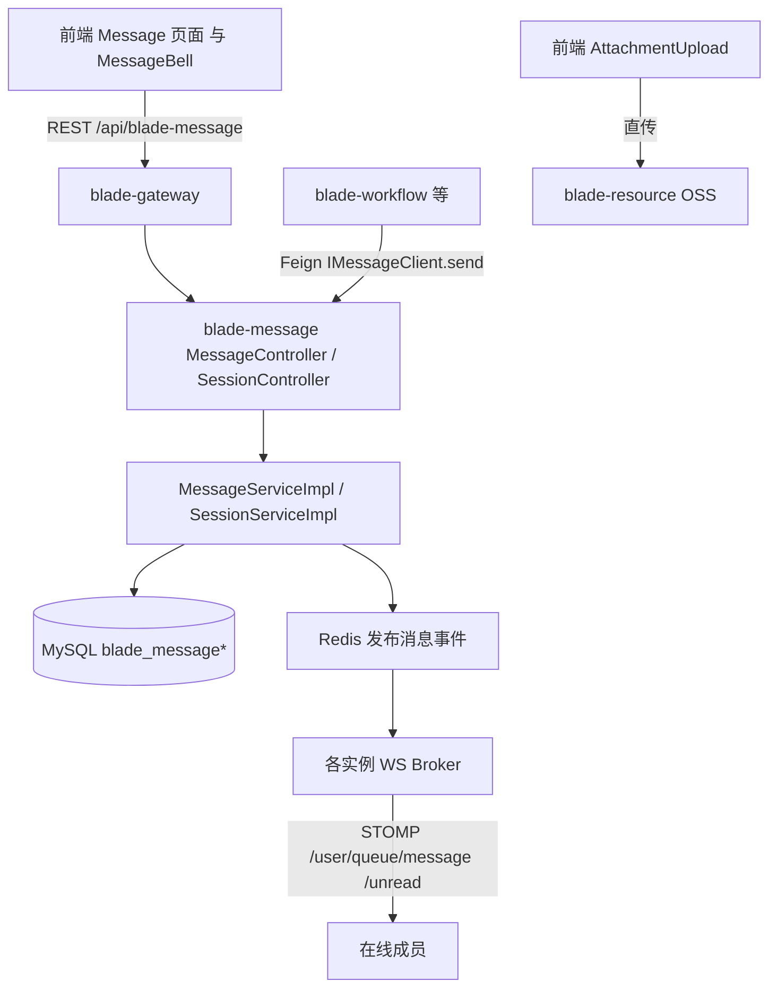
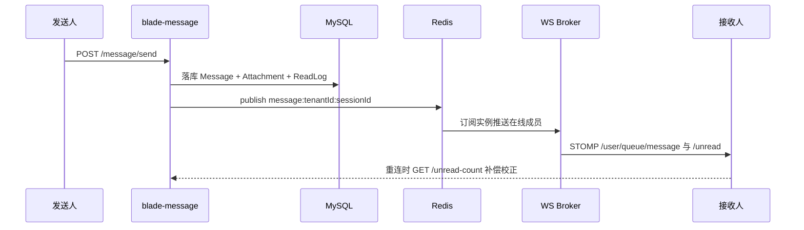

## 用户需求

新增"企业统一消息中心"模块，支持企业人员之间发送消息、上传附件、引用业务流程，并保障消息及时性（实时推送 + 补偿）。后端基于 SpringBlade 微服务（新模块 `blade-message`），前端基于 ant-design-pro（新页面 `Message` + 顶部铃铛）。严格遵循两份 CLAUDE.md 的分层与文件规范。

## 产品概述

面向企业内部的统一人员会话消息通道，替代各业务零散站内信。以"会话"组织人员间（一对一/群）消息，消息可携带附件（前端直传 `blade-resource`）、可关联工作流实例/任务（`blade-workflow-api`）。消息先落库保证可追溯，再经 WebSocket 尽力推红点与新消息，断线重连以"拉未读"补偿，杜绝角标不跳。

## 核心功能

- 会话管理：创建/列表/置顶/免打扰；两人会话幂等复用
- 发送消息：文本、引用回复、关联流程、携带附件
- 附件上传：前端直传 `blade-resource`，消息仅存引用
- 流程引用：选择工作流实例/任务，消息承载 bizRefType/bizRefId，点击跳转
- 实时推送：WebSocket 推新消息 + 未读红点；重连补偿拉取
- 已读回执：单会话已读，红点归零
- 未读聚合：顶部铃铛全局红点
- 多租户隔离：会话/消息/附件均按 tenant_id 字段隔离

## 技术栈

- 后端：SpringBlade 微服务（Spring Cloud + Spring Boot 4 + Java 21 + MyBatis-Plus），新建 `blade-message` 业务模块；实时推送用 Spring WebSocket（STOMP over SockJS）+ Spring Data Redis 发布订阅；附件复用 `blade-resource`，流程引用复用 `blade-workflow-api`
- 前端：ant-design-pro（Umi Max v4 + React + antd v6 + ProComponents v3 + TypeScript strict + Tailwind v4）；WebSocket 客户端自建 `utils/messageSocket.ts`

## 实现方案

按"后端 Service 模块 → 前端页面"顺序填充实现（API 契约 `blade-message-api` 与前端 `service.ts`/`data.d.ts` 已完成并通过编译）。

- 后端：新建 `blade-message` 模块（继承 `blade-service`），含 Controller/Service/ServiceImpl(Mapper)/Wrapper/Feign 服务端实现/WebSocket。Entity/VO/DTO/Feign 契约已在 `blade-message-api`（TenantEntity、雪花主键 ToStringSerializer）。统一返回 `R<T>`，分页用 `Condition.getPage` + `Wrapper.pageVO`。
- 实时性：落库为真相；`MessageServiceImpl.send` 落库后向 Redis 频道 `message:{tenantId}:{sessionId}` 发布事件；各实例 `RedisMessageListenerContainer` 订阅并经由本实例 WS Broker 推 `/user/{userId}/queue/message` 与 `/user/{userId}/queue/unread`；握手 `?token=` 校验 JWT；断线重连前端调 `GET /unread-count` 校正。
- 附件：前端 `AttachmentUpload` 直传 `blade-resource`，拿到 fileId/url 随 `MessageSendDTO.attachments` 传后端落 `blade_message_attachment`。
- 流程引用：`BizReferencePicker` 调 `blade-workflow` 列出当前用户实例/任务，回填 bizRefType/bizRefId（字符串）。

## 实现注意事项

- 所有新建 Java 文件含 Apache 2.0 许可头 + `@author Chill`；Java 用 Tab 缩进；Entity 注解顺序 `@Data`→`@EqualsAndHashCode(callSuper=true)`→`@TableName`→`@Schema`；Long 主键 `@JsonSerialize(ToStringSerializer.class)`
- 跨服务依赖只经 `blade-*-api` + Feign，禁止 `blade-service/A` 直依赖 `blade-service/B`
- 多租户：表均 TenantEntity；Redis 频道带 tenantId 前缀防串租户
- 前端严禁编辑 `src/services/ant-design-pro/`；写 antd 组件前 `npx antd info`；`npm run lint`(Biome+tsc) 与 `npx antd lint` 须通过；请求复用 `request`(from umi) + `ApiResponse`
- 编译由 AI 执行 `mvn -pl blade-service/blade-message -am compile -DskipTests`；运行/联调交用户

## 架构设计

### 分层架构



### 实时推送时序



## 目录结构

### 后端（新建 blade-message Service 模块）

```
SpringBlade/blade-service/blade-message/
├── pom.xml                                          # [NEW] 继承 blade-service；依赖 blade-message-api/blade-core-boot/blade-starter-swagger/blade-user-api/blade-workflow-api/blade-resource-api/blade-core-test(test)
├── src/main/java/org/springblade/message/
│   ├── MessageApplication.java                      # [NEW] @BladeCloudApplication 启动类
│   ├── controller/
│   │   ├── SessionController.java                   # [NEW] /message/session/page、/message/session/create
│   │   └── MessageController.java                    # [NEW] /message/session/{id}/messages、/message/message/send、/message/message/read、/message/message/unread-count
│   ├── service/
│   │   ├── ISessionService.java                     # [NEW] BaseService 接口
│   │   ├── IMessageService.java                     # [NEW] BaseService 接口（含 send/markRead/unreadCount）
│   │   └── impl/ SessionServiceImpl.java / MessageServiceImpl.java  # [NEW] BaseServiceImpl
│   ├── mapper/                                       # [NEW] SessionMapper/SessionMemberMapper/MessageMapper/MessageAttachmentMapper/MessageReadLogMapper + 同包 XML
│   ├── wrapper/ MessageWrapper.java / SessionWrapper.java  # [NEW] Entity→VO
│   ├── feign/ MessageClientController.java          # [NEW] @RestController implements IMessageClient（跨服务 send）
│   └── websocket/                                    # [NEW] WebSocketConfig(STOMP+SockJS)、JwtHandshakeInterceptor、MessageRealtimePublisher、RedisMessageSubscriber
└── src/main/resources/ application.yml / application-dev.yml     # [NEW] server.port、数据源、Redis、WS 配置

SpringBlade/doc/sql/
└── blade_message.sql                               # [NEW] 5 张表 DDL（blade_message_session/_session_member/_message/_attachment/_read_log，多租户字段）
```

### 前端（新建/修改）

```
ant-design-pro/src/
├── pages/Message/
│   ├── index.tsx                                    # [NEW] 主页：左 SessionList + 右 ChatPanel
│   ├── service.ts                                   # [已有-契约] 6 个 API
│   ├── data.d.ts                                    # [已有-契约] 类型
│   └── components/
│       ├── SessionList.tsx                          # [NEW] 会话列表+未读 Badge+置顶/免打扰
│       ├── ChatPanel.tsx                            # [NEW] 消息流+输入框+发送
│       ├── MessageItem.tsx                          # [NEW] 单条消息（文本/引用/附件/流程卡片）
│       ├── AttachmentUpload.tsx                      # [NEW] 直传 blade-resource
│       └── BizReferencePicker.tsx                   # [NEW] 选工作流实例/任务
├── components/MessageBell/index.tsx                 # [NEW] 顶部铃铛红点（订阅 WS）
├── utils/messageSocket.ts                           # [NEW] WS 连接/重连/订阅 message+unread
├── config/routes.ts                                 # [MODIFY] 增加 menu.message 路由（access 门控）
└── locales/zh-CN.ts 等                              # [MODIFY] 追加 menu.message 等 i18n
```

### 网关与配置

```
SpringBlade/blade-gateway/...                        # [MODIFY] 增加 /blade-message/** 与 /blade-message/ws/**→lb:ws://blade-message 路由
Nacos blade.yaml / blade-message application-dev.yml # [MODIFY] 端口、数据源、Redis、WS（运行期配置）
```

## 关键代码结构（可选）

实时推送发布接口（位于 blade-message websocket 包）：

```
public interface MessageRealtimePublisher {
    void publishNewMessage(Message message, List<Long> memberIds);
    void publishUnread(Long userId, UnreadCountVO unread);
}
```

## 设计风格

企业级即时消息中心，采用现代简洁的双栏布局（左会话列表、右聊天窗），顶部 ProLayout 头部嵌入铃铛红点。整体沿用 antd v6 设计语言与 BladeX 蓝色主调，卡片化、留白充足、hover 微交互，消息气泡区分收发两侧。实时性通过红点角标与消息即时插入体现，营造"活"的协作感。

## 页面规划

### 消息中心主页（pages/Message/index.tsx）

- 区块1 顶部工具条：标题"消息中心" + 搜索框（按会话/成员过滤）+ "发起会话"按钮
- 区块2 左侧会话列表（SessionList）：每项显示头像/名称、最后一条消息摘要、时间、未读 Badge、置顶与免打扰图标；选中高亮
- 区块3 右侧聊天窗（ChatPanel）：顶部会话名+成员；中部消息流（MessageItem 气泡，左收右发，附件卡片、流程引用卡片可点跳转）；底部输入区含文本框、附件按钮、引用流程按钮、发送按钮
- 区块4 空态/加载：无会话时引导"发起会话"；消息分页游标加载（上拉更早）

### 顶部铃铛（components/MessageBell）

- 区块1 ProLayout Header 右侧铃铛图标 + Badge(全局未读数)
- 区块2 点击展开抽屉/下拉：列出各会话未读明细（SessionUnread），点击进入对应会话并标记已读

## 交互与响应式

- 桌面优先：双栏固定，聊天窗自适应宽度；移动端可切换（会话列表与聊天窗分屏）
- 实时：WS 收到 message/unread 即刷新列表角标与聊天窗；断线重连自动校正
- 微动画：消息进入淡入、红点 pulse、hover 行高亮

## 代理扩展

### SubAgent

- **code-explorer**
- 用途：实现前端附件直传与流程引用时，定位 `blade-resource` 上传接口、`blade-workflow-api` 引用接口、`blade-desk` 现有页面样板的确切路径与签名
- 预期结果：给出可复用的接口路径/方法签名，避免凭记忆拼写错误

### Skill

- **springblade-dev-login**
- 用途：后端 `blade-message` 起服后，获取 sword-token 并调用 `/blade-message` 接口与 WebSocket 进行端到端联调验证
- 预期结果：产出可用 token 与联调证据（会话创建、发消息、红点推送、未读校正）