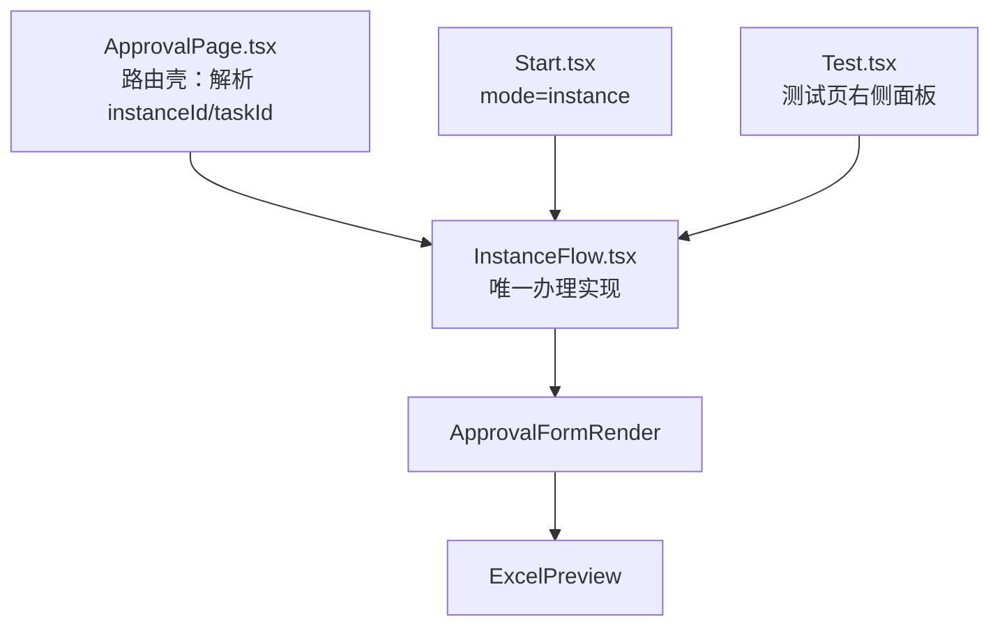

## 产品概述

把「生产办理页 `ApprovalPage`"与「发起页 instance 态 / 测试页共用的 `InstanceFlow`"两套平行的办理实现合并为一套，消除同一功能两处维护、行为漂移的问题。

## 核心目标

- 生产办理、发起页 instance 态、流程测试页三处共用同一个办理组件
- `ApprovalPage.tsx` 瘦身为只解析 URL 参数的路由壳
- 合并过程中不丢失 `ApprovalPage` 已有的业务能力，同时修复 `InstanceFlow` 现存缺陷

## 已完成（本计划基于这些继续，不重复）

- 第 1 步：修 `Number(assignee)` 雪花 ID 精度丢失；修提交不下发 `variables`
- 第 2 步第一批：过期复检（stale）已移植并加门控 `staleEnabled`

## 本计划范围（剩余批次）

1. 退回候选：拉候选节点并支持选择退回目标
2. 传阅：多人选人 + `circulateTask`
3. 自定义操作 `custom`：拉取与执行节点自定义按钮
4. 附件上传：`Upload` 控件
5. 意见系统升级：三档必填（all/byOperation）+ 意见显示设置
6. 提交三层校验 `validateForm` + 完成态与按操作类型自动关页
7. `ApprovalPage` 瘦身为路由壳，三态回归验证

## 验收口径

生产办理页、发起页 instance 态、测试页（含查看历史节点）三处行为一致、无回归；改动文件 `read_lints` 无错。

## 技术栈

沿用项目现有栈：React + TypeScript + Ant Design（Ant Design Pro），请求层 `@/services/workflow`，表单执行引擎 `ExcelPreview` + `ApprovalFormRender`。

## 实现方案

### 合并方向

以 `ApprovalPage` 的**业务动作**为内核，外裹 `InstanceFlow` 的 **props 化外壳**（可内嵌、多形态），最终 `ApprovalPage` 退化为路由壳。

### 架构关系



### 关键技术决策

- **保留 `InstanceFlow` 的按钮缺省语义**（`pkg.allowMenus == null` → 全量），与 `Start.tsx` 一致；不采用 `ApprovalPage` 的"缺省=无按钮"
- **任何"以当前节点为准"的判定必须门控**：`InstanceFlow` 允许查看任意历史节点（测试页"查看节点"），照搬 `ApprovalPage` 的无差别逻辑会误判
- **动作接入测试态 `TEST_BLOCKED_MENUS` 语义**：新增的传阅、自定义操作、附件等在测试态置灰并给出悬浮说明，而非隐藏
- **意见系统取 `ApprovalPage` 口径**：`opinionMustInput`(never/all/byOperation) + `opinionMustInputOperations`，替换 `InstanceFlow` 现有单一 `opinionRequired`

### 必须遵守的约束（已踩坑）

- **19 位雪花 ID 全程字符串**，禁止 `Number()` 转换。特别注意：`services/workflow` 中 `listCustomOperations(defId: number, nodeKey: string)`、`executeCustomOperation(opId: number, instId: number)` 签名是 `number`，`ApprovalPage` 里的 `Number(pkg.defId)` 属同类隐患；移植时应改造为按字符串下发（后端 DTO 为 Long 时 Jackson 可反序列化数字字符串），或对齐后端签名后再定
- 新增能力按 props 开关化，不得假定"独立页面"
- 需新增导入：`rejectNodes`(index.ts:759)、`circulateTask`(:771)、`validateForm`(:883)、`listCustomOperations`(:1323)、`executeCustomOperation`(:1345) —— 均已在 `@/services/workflow` 导出

## 目录结构

```
ant-design-pro/src/pages/Workflow/Create/
└── InstanceFlow.tsx   # [MODIFY] 唯一办理实现。逐批移植：退回候选+目标选择、
                       #           传阅、自定义操作、附件上传、意见三档+显示设置、
                       #           提交前 validateForm 三层校验、完成态与自动关页。
                       #           已含：stale 过期复检、String(assignee)、variables 下发

ant-design-pro/src/pages/FormMode/Approval/
└── ApprovalPage.tsx   # [MODIFY] 最终瘦身为路由壳：仅解析 URL 的 instanceId/taskId，
                       #           渲染 InstanceFlow；删除重复的 pkg/allowMenus/按钮栏/
                       #           意见/日志/流程图等实现

ant-design-pro/src/pages/Workflow/Create/
└── Start.tsx          # [AFFECTED] instance 态调用方，需回归验证（不改动逻辑）

ant-design-pro/src/pages/FormMode/Test/
└── Test.tsx           # [AFFECTED] 测试页调用方，需回归验证（查看历史节点不得报过期）
```

## 关键代码结构

意见必填判定（替换 `InstanceFlow` 现有单一 `opinionRequired`）：

```ts
/** 意见是否必填：never=从不 / all=所有操作 / byOperation=仅指定操作 */
type OpinionMustInput = 'never' | 'all' | 'byOperation';

/** 由渲染包判定某操作是否要求必填意见 */
declare function isOpinionRequired(
  op: string,                       // 操作码：submit / reject / consultReply ...
  mustInput?: string | null,        // pkg.opinionMustInput
  mustInputOperations?: string[],   // pkg.opinionMustInputOperations
): boolean;
```

## Agent Extensions

### SubAgent

- **code-explorer**
- 用途：移植每批能力前，核对 `ApprovalPage.tsx` 中对应实现的完整代码（取数、UI、失败处理、边界条件），避免移植时漏掉隐性逻辑
- 预期结果：每批拿到带 `文件:行号` 证据的移植依据，移植后与源实现语义等价