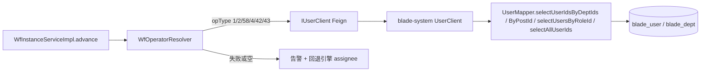

## 产品概述

在 `blade-user-api` 的用户中心 Feign 上补齐「按部门/角色/岗位/所有人 查询用户ID」能力，并让 `blade-workflow` 的节点操作者解析器真正消费它，从而让「节点信息 → 操作者」中配置的部门/角色/岗位/所有人能在流转运行时展开成真实待办。上一轮已实现 `WfOperatorResolver` 与「按操作者展开多条 wf_task」，但部门/角色/岗位/所有人分支被刻意降级为空集合（因为 blade-workflow 无任何 Feign、无 sys_* 表）。本次补齐该降级项。

## 核心功能

- 用户中心新增 4 个查询接口：按部门（可选含下级）、按角色、按岗位、所有人，均返回用户ID列表。
- 操作者解析器接入远端调用：`opType` 1部门 / 2角色 / 58岗位 / 4所有人 / 42字段-部门 / 43字段-角色 可解析为真实办理人。
- 容错：远端不可用、超时、返回空时一律告警并退回原有行为（引擎 assignee），绝不阻塞发起/审批主链路。
- 「上级」类（18创建人上级 / 41上级 / 6字段-人员上级）本轮不做：`blade_dept` 无负责人字段，缺少数据源，保留告警降级并留扩展位。
- 多值匹配：`blade_user` 的 `dept_id/role_id/post_id` 为逗号串，按既有 `FIND_IN_SET` 惯例匹配；「含下级」用 `blade_dept.ancestors` 取子孙部门。

## 范围边界

- 不改前端；不改流转主流程语义；不新增架构层，全部落在既有类与既有 Feign 模式上。
- 涉及 `blade-user-api` 变更，需执行一次双 Maven 仓库同步。

## 技术栈

- 后端：Java 21 + Spring Boot 4.x + Spring Cloud Alibaba（Nacos/OpenFeign）+ MyBatis-Plus + Flowable。
- 模块：`blade-service-api/blade-user-api`（Feign 契约）、`blade-service/blade-system`（用户中心实现）、`blade-service/blade-workflow`（消费方）。

## 实现思路

沿用 SpringBlade 既有 Feign 契约模式：接口放 `-api`，实现放 `blade-system/feign`，SQL 放既有 `UserMapper(.xml)`；消费方（blade-workflow）只加依赖并注入客户端。全部为「新增方法 + 新增分支」，不改动已有方法签名与行为。



## 关键设计决策

1. **接口放哪**：新增能力放 `IUserClient`（`@FeignClient(APPLICATION_SYSTEM_NAME)`，服务端实现 `UserClient` 同在 blade-system），与现有 `userInfo/getUserByAccount` 同类；不塞进 `ISysClient`（那是名称↔ID 转换职责）。
2. **参数用 `@RequestParam`**：本环境 `@RequestBody` 根类型禁泛型容器；查询用简单参数即可规避该坑。
3. **匹配多值逗号串**：复用既有 `selectUsersByRoleId` 的 `FIND_IN_SET(#{x}, col) > 0` 写法，新增 dept/post 两条同构 SQL。
4. **含下级部门**：`Dept` 确认有 `ancestors`（祖级机构主键），故 `containChild=true` 时先 `FIND_IN_SET(#{deptId}, ancestors) > 0` 取子孙部门集合，再按集合匹配用户；避免递归查询。
5. **所有人上限**：`selectAllUserIds` 加 `LIMIT #{limit}`（默认 2000）并在 Java 层校验，防止万级用户一次拉爆内存与网络。
6. **降级隔离**：`WfOperatorResolver` 对新分支统一「try/catch + 空判 + warn」，与既有 `OP_USER/OP_CREATOR/OP_FIELD_USER` 分支的失败语义保持一致；Feign fallback 返回空列表而非抛错。
7. **「上级」不实现**：已确认 `Dept` 只有 `parentId/ancestors`、**无 `leaderUserId`**，无可靠数据源；本轮保留告警降级，注释写明后续接入路径（需补负责人字段或在 UserMapper 增加 `selectLeaderUserId`）。

## 性能与可靠性

- 每条查询走 `blade_user` 主键/普通列；`FIND_IN_SET` 无法走索引，属既有约定（`selectUsersByRoleId` 同款），数据量可控时分钟级可接受；「所有人」用 LIMIT 兜底。
- 解析只在「生成待办时」按节点触发一次，不在循环内重复远端调用；`WfOperatorResolver` 已按节点聚合后去重。
- 租户隔离：Feign 透传 Blade 上下文头，`blade_user` 受租户拦截器约束，解析结果天然限定在当前租户（符合预期，不做额外处理）。
- 任何远端异常不得影响流转：失败即空集合，`advance()` 回退到引擎 assignee 单条待办（上一轮已实现）。

## 后端接口与 SQL 设计（要点）

- `IUserClient` 新增（`API_PREFIX="/user"`，均 `@GetMapping`）：
- `R<List<Long>> userIdsByDept(Long deptId, Boolean containChild)`
- `R<List<Long>> userIdsByRole(Long roleId)`
- `R<List<Long>> userIdsByPost(Long postId)`
- `R<List<Long>> allUserIds()`
- `IUserClientFallback` 同步补 4 个实现，返回空列表（降级为空，不抛错）。
- `UserMapper` 新增：`selectUserIdsByDeptIds(List<Long>)`、`selectUserIdsByPostId(Long)`、`selectChildDeptIds(Long)`、`selectAllUserIds(Integer limit)`；XML 追加同构 `<select>`。
- 空集合短路：`deptIds` 为空时 Java 层直接返回空列表，避免 `foreach` 产出非法 SQL。
- `UserClient` 新增 4 个 `@GetMapping` 端点，内部转 `UserMapper`（角色直接复用既有 `selectUsersByRoleId` 并抽取 id）。
- `blade-workflow/pom.xml` 增加 `org.springblade:blade-user-api` 依赖。
- `WfOperatorResolver.resolveByType` 增加分支：部门（`bhxj==1` → containChild）、角色、岗位、字段-部门、字段-角色、所有人；`OP_CREATOR_LEADER/OP_LEADER/OP_FIELD_USER_LEADER` 维持 warn 降级。

## 双 Maven 仓库同步（必须按序）

1. `cd d:\workproject\springbladeandreact\springBlade`
2. `mvn -pl blade-service-api/blade-user-api clean install -DskipTests "-Dmaven.compiler.proc=full"`
3. 复制 `%USERPROFILE%\.m2\repository\org\springblade\blade-user-api\<ver>\blade-user-api-<ver>.jar` 到 `E:\project\mavenLib\org\springblade\blade-user-api\<ver>\`，**先 Rename 让位再 Copy**（该路径在工作区外，需用户授权）。版本取 `${revision}`（同 blade-workflow-api 实测为 5.0.1，须以实际为准）。
4. `mvn -pl blade-service/blade-system compile -DskipTests "-Dmaven.compiler.proc=full"`
5. `mvn -pl blade-service/blade-workflow compile -DskipTests "-Dmaven.compiler.proc=full"`
6. 判断成败看输出中的 `BUILD SUCCESS|BUILD FAILURE` 文本，不用 exitCode；严禁 `-Dmaven.repo.local=E:/...`。

## 目录结构（涉及文件）

```
springBlade/
├── blade-service-api/blade-user-api/src/main/java/org/springblade/system/user/feign/
│   ├── IUserClient.java            # [MODIFY] 新增 4 个按部门/角色/岗位/所有人查用户ID 方法
│   └── IUserClientFallback.java    # [MODIFY] 同步补 4 个降级实现（返回空列表）
├── blade-service/blade-system/src/main/java/org/springblade/system/
│   ├── feign/UserClient.java       # [MODIFY] 新增 4 个 @GetMapping 端点，转 UserMapper
│   └── mapper/UserMapper.java      # [MODIFY] 新增 selectUserIdsByDeptIds/ByPostId/selectChildDeptIds/selectAllUserIds
├── blade-service/blade-system/src/main/java/org/springblade/system/mapper/UserMapper.xml
│                                   # [MODIFY] 追加 4 条同构 SQL（FIND_IN_SET 多值匹配、ancestors 取子孙部门、LIMIT 上限）
└── blade-service/blade-workflow/
    ├── pom.xml                     # [MODIFY] 增加 blade-user-api 依赖
    └── src/main/java/org/springblade/workflow/resolver/WfOperatorResolver.java
                                    # [MODIFY] 注入 IUserClient；接上部门/角色/岗位/字段-部门/字段-角色/所有人 分支，Feign 失败告警降级
```

## 验证方式

- 编译：blade-user-api / blade-system / blade-workflow 三处 `BUILD SUCCESS`。
- 运行态（需用户配合，Playwright 无法登录）：给某节点配「部门」操作者 → 发起实例 → 查 `wf_task` 是否按部门成员展开为多条（会签/或签/依次门禁沿用已有逻辑）；从节点信息「操作者」弹窗可看到新增的 groupNo/安全级别等字段一并生效。
- 容错：临时停掉 blade-system 服务或让 Feign 超时，观察日志出现 warn 且实例仍能发起并回退为引擎 assignee 单条待办。

## Agent Extensions

### SubAgent

- **code-explorer**
- Purpose: 在动手前核对「用户中心 Feign」改造的完整影响面：`IUserClient` 的全部实现类（`UserClient`、`IUserClientFallback`）与全部调用方；确认 `blade_user` 的多值逗号串字段现状、`blade_dept.ancestors` 的取值格式，以及 `blade-system` 是否已有按部门/岗位查用户的可复用 SQL。
- Expected outcome: 输出一份「必须同步修改的实现类清单 + 可复用 SQL 清单 + 风险点（多值匹配/租户/空集合）」，确保新增接口方法后不会因漏实现一次性编译失败，并确认没有其它服务依赖这些新方法。