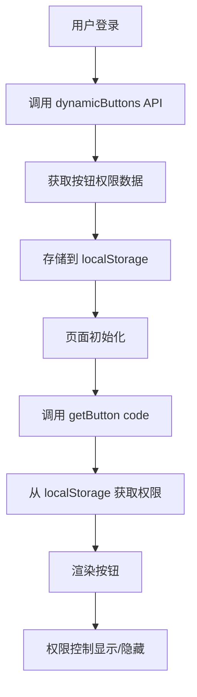

# Sword 项目按钮权限 API 分析

## 📋 概述

本文档详细分析了 Sword 项目中按钮权限控制的实现机制，包括前端 API 调用、权限存储、权限校验等核心功能。

---

## 🔑 核心 API

### 获取按钮权限列表

**API 路径：** `/api/blade-system/menu/buttons`

**服务层定义：**
```javascript
// src/services/menu.js
export async function dynamicButtons() {
  return request('/api/blade-system/menu/buttons');
}
```

**请求方式：** GET

**认证方式：** 需要在请求头中携带 Token

---

## 📁 相关文件结构

### 1. API 服务文件

**路径：** `src/services/menu.js`

**主要函数：**
```javascript
// 获取动态路由
export async function dynamicRoutes() {
  return request('/api/blade-system/menu/routes');
}

// 获取按钮权限列表
export async function dynamicButtons() {
  return request('/api/blade-system/menu/buttons');
}

// 获取菜单列表
export async function list(params) {
  return request(`/api/blade-system/menu/list?${stringify(params)}`);
}
```

### 2. 权限工具函数

**路径：** `src/utils/authority.js`

**核心函数：**

#### getButtons() - 获取所有按钮权限
```javascript
export function getButtons() {
  return JSON.parse(localStorage.getItem('sword-buttons')) || [];
}
```

#### getButton(code) - 获取指定页面的按钮权限
```javascript
export function getButton(code) {
  const buttons = getButtons();
  const data = buttons.filter(d => {
    return d.code === code;
  });
  return data.length === 0 ? [] : data[0].buttons;
}
```

#### setButtons(buttons) - 存储按钮权限
```javascript
export function setButtons(buttons) {
  localStorage.removeItem('sword-buttons');
  localStorage.setItem('sword-buttons', JSON.stringify(buttons));
}
```

#### hasButton(buttons, code) - 检查按钮权限
```javascript
export function hasButton(buttons, code) {
  return buttons.filter(button => button.code === code).length > 0;
}
```

### 3. 使用位置

| 文件路径 | 用途 |
|---------|------|
| `src/models/menu.js` | 菜单模型中获取按钮权限 |
| `src/models/login.js` | 登录成功后获取按钮权限 |
| `src/models/role.js` | 角色授权时获取按钮权限 |
| `src/components/Sword/Grid.js` | Grid 组件中使用按钮权限 |
| `src/pages/Base/Region/Region.js` | 页面组件中使用按钮权限 |

---

## 🔄 工作流程

### 完整流程图



### 详细步骤

#### 1. 登录成功后获取权限

```javascript
// src/models/login.js
*fetchLogin({ payload }, { call, put }) {
  // ... 登录逻辑
  const responseButtons = yield call(dynamicButtons);
  setButtons(formatButtons(responseButtons));
}
```

#### 2. 菜单模型中获取权限

```javascript
// src/models/menu.js
*fetchMenuData({ payload }, { call, put }) {
  // 设置按钮数据
  let buttons = getButtons();
  if (buttons.length === 0) {
    const response = yield call(dynamicButtons);
    buttons = formatButtons(response.data);
    setButtons(buttons);
  }
}
```

#### 3. 页面组件中使用权限

```javascript
// src/pages/Base/Region/Region.js
import { getButton, hasButton } from '../../../utils/authority';

const Region = (props) => {
  const buttons = getButton('region');
  
  // 渲染按钮
  return (
    <Grid
      code="region"
      buttons={buttons}
      // ... 其他属性
    />
  );
};
```

#### 4. Grid 组件中集成权限

```javascript
// src/components/Sword/Grid.js
import { getButton } from '../../utils/authority';

class Grid extends Component {
  constructor(props) {
    super(props);
    this.state = {
      buttons: getButton(props.code), // 根据页面 code 获取按钮权限
    };
  }
  
  render() {
    // 根据 buttons 渲染操作按钮
    return (
      // ... 渲染逻辑
    );
  }
}
```

---

## 📊 数据格式

### 按钮权限数据结构

**后端返回格式：**
```json
[
  {
    "code": "system.user",
    "buttons": [
      {
        "code": "user:add",
        "name": "新增",
        "action": 1,
        "alias": "add",
        "source": "",
        "path": ""
      },
      {
        "code": "user:edit",
        "name": "编辑",
        "action": 2,
        "alias": "edit",
        "source": "",
        "path": ""
      },
      {
        "code": "user:delete",
        "name": "删除",
        "action": 2,
        "alias": "delete",
        "source": "",
        "path": ""
      }
    ]
  },
  {
    "code": "system.dept",
    "buttons": [
      {
        "code": "dept:add",
        "name": "新增",
        "action": 1,
        "alias": "add",
        "source": "",
        "path": ""
      }
    ]
  }
]
```

### 字段说明

| 字段 | 类型 | 说明 |
|------|------|------|
| code | String | 页面标识或按钮标识 |
| name | String | 按钮显示名称 |
| action | Number | 按钮显示位置：1=顶部，2=行内，3=都显示 |
| alias | String | 按钮别名（add, edit, delete 等） |
| source | String | 按钮图标 |
| path | String | 按钮路径 |

### LocalStorage 存储格式

**Key：** `sword-buttons`

**Value：** JSON 字符串
```javascript
// 存储的数据
localStorage.setItem('sword-buttons', JSON.stringify(buttons));

// 获取的数据
const buttons = JSON.parse(localStorage.getItem('sword-buttons'));
```

---

## 🔍 权限校验机制

### 按钮级别权限控制

```javascript
// 检查是否有特定按钮权限
const hasPermission = hasButton(buttons, 'user:add');

// 过滤按钮列表
const visibleButtons = buttons.filter(button => {
  return hasPermission(button.code);
});
```

### 页面级别权限控制

```javascript
// 获取页面的所有按钮权限
const pageButtons = getButton('system.user');

// 根据权限渲染按钮
{pageButtons.some(btn => btn.code === 'user:add') && (
  <Button type="primary">新增</Button>
)}
```

---

## 🎯 最佳实践

### 1. 统一使用 getButton 获取权限

```javascript
// ✅ 推荐
const buttons = getButton('system.user');

// ❌ 不推荐
const buttons = JSON.parse(localStorage.getItem('sword-buttons'))
  .filter(item => item.code === 'system.user')[0]?.buttons;
```

### 2. 在组件中集成权限检查

```javascript
// 在 Grid 组件中
useEffect(() => {
  const btns = getButton(code);
  setButtons(btns || []);
}, [code]);
```

### 3. 按钮权限与 UI 分离

```javascript
// 权限判断与渲染分离
const canAdd = buttons.some(btn => btn.code === 'user:add');

return (
  <>
    {canAdd && <Button>新增</Button>}
  </>
);
```

---

## 🛠️ 扩展功能

### 后端实现（Java）

**权限校验处理器：**
```java
// BladePermissionHandler.java
@Override
public boolean hasPermission(String permission) {
  HttpServletRequest request = WebUtil.getRequest();
  BladeUser user = AuthUtil.getUser();
  if (request == null || user == null) {
    return false;
  }
  List<String> codes = permissionCode(permission, user.getRoleId());
  return !codes.isEmpty();
}
```

**SQL 查询：**
```java
// PermissionConstant.java
static String permissionCodeStatement(int size) {
  return StringUtil.format(
    "select resource_code as code from blade_scope_api " +
    "where resource_code = ? and id in " +
    "(select scope_id from blade_role_scope " +
    "where scope_category = 2 and role_id in ({}))", 
    buildHolder(size)
  );
}
```

---

## 📝 总结

### 核心要点

1. **API 接口：** `/api/blade-system/menu/buttons`
2. **存储方式：** localStorage 的 `sword-buttons`
3. **获取方法：** `getButton(code)`
4. **校验方法：** `hasButton(buttons, code)`
5. **使用场景：** Grid 组件、页面组件、权限判断

### 优势

- ✅ 集中管理：所有按钮权限统一存储
- ✅ 按需加载：只在需要时获取对应页面的权限
- ✅ 灵活控制：支持页面级和按钮级权限控制
- ✅ 易于扩展：方便添加新的权限校验逻辑

### 注意事项

- ⚠️ 需要在登录成功后及时获取权限数据
- ⚠️ LocalStorage 有大小限制，不适合存储大量数据
- ⚠️ 权限变更需要重新获取或清除缓存

---

**文档版本：** v1.0  
**更新日期：** 2026-03-20  
**参考项目：** SpringBlade Sword
